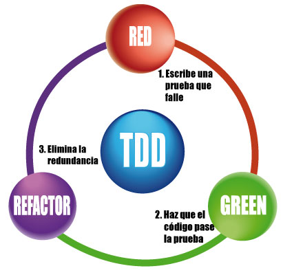
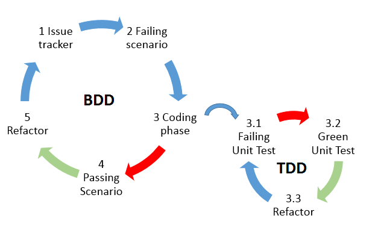
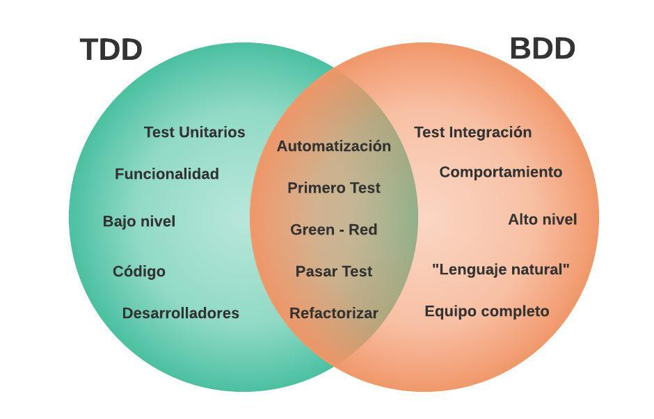

# Desarrollo de Aplicaciones Cloud Native

## Entorno de desarrollo

- AWS Cloud9
- Cloud Code

## Control de Versiones

### Git

- estados:


Básico:

- init / clone
- add
- commit

Trabajando con Ramas:

- branch
- checkout 
- merge
a) Fusión rápida: Fast-forward
b) Fusión a 3 bandas. 3-way merge

Repositorios remotos:

- remote
- push
- fetch / pull

## TDD y BDD con Python para una API con FLASK


### TDD

https://code.tutsplus.com/tutorials/beginning-test-driven-development-in-python--net-30137


TDD o Test-Driven Development (desarrollo dirigido por tests) es una práctica de programación que utiliza el ciclo Red - Green - Refactor, que consiste en escribir primero los test; en este caso pruebas unitarias sobre funcionalidad, después escribir el código que pase las pruebas y, por último, refactorizar el código escrito.



Ejemplo: Supongamos que deseamos implementar un conversor de temperatura de grados Fahrenheit a grados Centigrados. Los test incluirán el código que se desea implementar junto con afirmaciones (aserciones) que deben cumplirse.

```python
# Test Conversor Temperaturas test_conversor.py
def test_fahrenheit_to_centigrados():
    conversor = Conversor()
    assert hasattr(conversor, "fahrenheit_to_centigrados"), "La clase Conversor debe tener un método fahrenheit_to_centigrados"
    assert conversor.fahrenheit_to_centigrados(32) == 0, "32ºF son 0ºC"
    assert conversor.fahrenheit_to_centigrados(50) == 10, "50ºF son 10ºC"

```

### BDD

BDD o Behavior-Driven Development (desarrollo dirigido por comportamiento), es una técnica de diseño y desarrollo con la misma filosofía que TDD (ciclo Red - Green - Refactor), pero en este caso los test se centran en el comportamiento del sistema, se escriben con el lenguaje de más alto nivel, como Gherkin (Feature, Scenario, Given, When, Then, And, But y Steps), describiendo casos de uso o historias de usuario.



A continuación, se muestra un ejemplo de BDD sin usar el lenguaje Gherkin.

```python
def test_python_homepage():
    options = webdriver.FirefoxOptions()
    options.add_argument("--headless")
    driver = webdriver.Firefox(options=options)
    driver.get("http://www.python.org")
    assert "Python" in driver.title
    elem = driver.find_element(By.NAME, "q")
    elem.clear()
    elem.send_keys("pycon")
    elem.send_keys(Keys.RETURN)
    assert "No results found." not in driver.page_source
    driver.close()
```

Otro ejemplo, usando Gherkin

```
# home.feature file
Feature: Home Webpage

  Scenario: Hello world
    Given the home page
    When user writes his "name" and clicked send button
    Then app shows "Hello name" 
```

```python
# steps/test_home.py file

import pytest
 
from pytest_bdd import scenarios, given, when, then, parsers
from selenium import webdriver
from selenium.webdriver.common.keys import Keys
from selenium.webdriver.common.by import By

 # Constants
 APP_URL = 'http://127.0.0.1:5000/hello'

# Scenarios
scenarios('../features/web.feature')

# Fixtures
@pytest.fixture
def browser():
    options = webdriver.FirefoxOptions()
    options.add_argument("--headless")
    b = webdriver.Firefox(options=options)
    b.implicitly_wait(10)
    yield b
    b.quit()

# Given Steps
 @given('the home page')
def app_home(browser):
    browser.get(APP_URL)

# When Steps
@when(parsers.parse('user writes his "{name}" and clicked send button'))
def saysme_hello(browser, name):
    search_input = browser.find_element(By.ID,'name')
    send_button = browser.find_element('id', 'send')
    search_input.send_keys(name)
    send_button.click()

# Then Steps
 @then(parsers.parse('app shows "Hello {name}"'))
def hello(browser, name):
    saludo = "Hello " + name
    assert saludo in browser.page_source
```


### TDD vs BDD



## TDD y BDD en Python

Obviamente, TDD y BDD se puede realizar para cualquier lenguaje de programación. En este caso, trabajaremos en Python. En Python existen muchas librerías para ello, pero en este caso utilizaremos Pytest y Pytest-bdd

# Desarrollo con Python

## Entorno Virtual

```
C:\tdd-bdd> python -m venv environment

(environment) C:\tdd-bdd> python -V
Python 3.11.1

(environment) C:\tdd-bdd> pip -V
pip 23.0.1 from C:\tdd-bdd\environment\Lib\site-packages\pip (python 3.11)

(environment) C:\tdd-bdd> pip freeze

(environment) C:\tdd-bdd> pip list
Package    Version
---------- -------
pip        23.0.1
setuptools 65.5.0

```

# Flask y Flask-RESTX

Flask es un framework "liviano" para desarrollo de aplicaciones Web con Python.
https://flask.palletsprojects.com/en/2.2.x/

Flask-RESTX es un framework que facilita el desarrollo de APIs RESTful con Flask.
https://flask-restx.readthedocs.io/en/latest/quickstart.html 

```
(virtual_env)$ pip install flask==2.2.3

(virtual_env)$ pip install flask-restx==1.0.6
```

```
(virtual_env)$ pip list
Package              Version
-------------------- -------
aniso8601            9.0.1
attrs                22.2.0
click                8.1.3
colorama             0.4.6
Flask                2.2.3
flask-restx          1.1.0
importlib-metadata   6.1.0
importlib-resources  5.12.0
itsdangerous         2.1.2
Jinja2               3.1.2
jsonschema           4.17.3
MarkupSafe           2.1.2
pip                  23.0.1
pkgutil_resolve_name 1.3.10
pyrsistent           0.19.3
pytz                 2023.3
setuptools           39.0.1
typing_extensions    4.5.0
Werkzeug             2.2.3
zipp                 3.15.0

```

# Test con PyTest
https://docs.pytest.org/en/7.1.x/contents.html

[Book] Brian Okken. (2022). Python Testing with pytest: Simple, Rapid, Effective, and Scalable; 2. edición. O'Reilly Media.


Instalar PyTest

```
(environment) C:\tdd-bdd> pip install pytest
Collecting pytest
...
...
Installing collected packages: pluggy, packaging, iniconfig, colorama, attrs, pytest
Successfully installed attrs-22.2.0 colorama-0.4.6 iniconfig-2.0.0 packaging-23.0 pluggy-1.0.0 pytest-7.2.2

(environment) C:\tdd-bdd> pip freeze
attrs==22.2.0
colorama==0.4.6
iniconfig==2.0.0
packaging==23.0
pluggy==1.0.0
pytest==7.2.2

(environment) C:\tdd-bdd> pip list
Package    Version
packaging  23.0
pip        23.0.1
pluggy     1.0.0
pytest     7.2.2
setuptools 65.5.0

(environment) C:\tdd-bdd> pytest -V
pytest 7.2.2

```

Ejecutar test: 

```
(environment) C:\tdd-bdd> pytest -v
```

pytest ejecutará todos los ficheros test_*.py o *_test.py en el directorio actual y sus subdirectorios

## Instalar pytest-bdd
https://pytest-bdd.readthedocs.io/en/stable/

```
(environment) C:\tdd-bdd> pip install pytest-bdd
```

## Instalar Selenium
https://www.selenium.dev/documentation/

```
(environment) C:\tdd-bdd> pip install selenium
Collecting selenium
...
...
Installing collected packages: selenium
Successfully installed selenium-4.8.3
```
Para la navegación necesitarás instalar un Driver https://www.selenium.dev/documentation/webdriver/getting_started/install_drivers/.
En windows podrás usar los navegadores que tengas instalados, como Firefox o Chrome.
Para linux podrás hacer uso de Geckodriver https://github.com/mozilla/geckodriver/releases
o Chromedriver https://chromedriver.chromium.org/downloads

```
## Geckodriver
wget https://github.com/mozilla/geckodriver/releases/download/v0.33.0/geckodriver-v0.33.0-linux64.tar.gz
sudo sh -c 'tar -x geckodriver -zf geckodriver-v0.33.0-linux64.tar.gz -O > /usr/bin/geckodriver'
sudo chmod +x /usr/bin/geckodriver
rm geckodriver-v0.33.0-linux64.tar.gz

## Chromedriver
wget https://chromedriver.storage.googleapis.com/112.0.5615.49/chromedriver_linux64.zip
unzip chromedriver_linux64.zip
sudo chmod +x chromedriver
sudo mv chromedriver /usr/bin/
rm chromedriver_linux64.zip
```

Instalar Browser
```
sudo yum install -y firefox
```

## Estructura de directorios

```
[project root directory]
|‐‐ [src code]
|-- [test directories]
|   |-- bdd_test
|   |   |-- features
|   |   |   `-- *.feature
|   |   |-- step_defs
|   |       |-- __init__.py
|   |       |-- conftest.py
|   |       `-- test_*.py
|   |-- tdd_test
|       |-- __init__.py
|       `-- test_*.py
`-- [pytest.ini|tox.ini|setup.cfg]
```

## Ejemplos

### TDD Conversor de temperatura

```python
import pytest

from src.conversor import Conversor

@pytest.fixture
def conversor():
    try:
        conversor = Conversor()
    except:
        assert 0, "Es necesario crear la clase Conversor"
    return conversor


def test_fahrenheit_to_centigrados(conversor):
    assert hasattr(conversor, "fahrenheit_to_centigrados"), "La clase Conversor debe tener un método fahrenheit_to_centigrados"
    assert conversor.fahrenheit_to_centigrados(32) == 0, "32ºF son 0ºC"
    assert conversor.fahrenheit_to_centigrados(50) == 10, "50ºF son 10ºC"

def test_centigrados_to_fahrenheit(conversor):
    assert hasattr(conversor, "centigrados_to_fahrenheit"), "La clase Conversor debe tener un método centigrados_to_fahrenheit"
    assert conversor.centigrados_to_fahrenheit(0) == 32, "0ºC son 32ºF"
    assert conversor.centigrados_to_fahrenheit(10) == 50, "10ºC son 50ºF"
```

Implementación

```python

class Conversor:
    
    def fahrenheit_to_centigrados(self, f):
        return (f - 32) * 5 / 9
    
    def centigrados_to_fahrenheit(self, c):
        return c * 9 / 5 + 32

```


### BDD: Ejemplo Web

```
Feature: Ejemplo BDD

  Scenario: Primera Prueba
    Given la página principal
    When el usuario accede a ella
    Then se muestra el mensaje "Hola Mundo!"

```

```python
import pytest
 
from pytest_bdd import scenarios, given, when, then, parsers
from selenium import webdriver

# Constants
 
APP_URL = 'http://3.216.94.93:8080/'

# Scenarios
 
scenarios('../features/web.feature')

# Fixtures
 
@pytest.fixture
def browser():
    options = webdriver.FirefoxOptions()
    options.add_argument("--headless")
    b = webdriver.Firefox(options=options)
    b.implicitly_wait(10)
    yield b
    b.quit()

# Given Steps
 
@given('la página principal')
def app_home(browser):
    browser.get(APP_URL)

# When Steps
 
@when('el usuario accede a ella')
def saysme_hello():
    pass

# Then Steps
 
@then(parsers.parse('se muestra el mensaje "{saludo}"'))
def hello(browser, saludo):
    assert saludo in browser.page_source

```

Implementación

```python
from flask import Flask
app = Flask(__name__)


@app.route("/")
def hello_world():
    return "<p>Hola Mundo!</p>"

if __name__ == "__main__":
    app.run(host='0.0.0.0', port=8080, debug=True)
```

### BDD: Ejemplo API Conversor Temperatura

```
Feature: test myapi v2

  Scenario: convert fahrenheit to centigrados
    Given myapi version v2
    When user invokes GET /f2c/f
    Then api returns json with result: c
```

```python
import pytest
 
from pytest_bdd import scenarios, given, when, then, parsers
from selenium import webdriver
from selenium.webdriver.common.keys import Keys
from selenium.webdriver.common.by import By

import json

 
# Constants
 
APP_URL = 'http://127.0.0.1:5000/myapi/'

# Scenarios
 
scenarios('../features/api.feature')

# Fixtures
 
@pytest.fixture
def browser():
    options = webdriver.FirefoxOptions()
    options.add_argument("--headless")
    b = webdriver.Firefox(options=options)
    b.implicitly_wait(0.1)
    yield b
    b.quit()

# Given Steps
@given(parsers.parse('myapi version {v}'))
def app_home(browser, v):
    browser.get(APP_URL+'version')
    data = browser.page_source
    print(data)
    r = json.loads(data)
    assert r['version'] == v

# When Steps
@when(parsers.parse('user invokes GET /f2c/{f}'))
def saysme_hello(browser,f):
    browser.get(APP_URL+'/f2c/'+f)


# Then Steps
@then(parsers.parse('api returns json with result: {c}'))
def hello(browser, c):
    data = browser.page_source
    r = json.loads(data)
    assert r['result'] == c

```

Implementación

```python
from flask import Flask, jsonify
from flask_restx import Resource, Api

from src.Conversor import Conversor


# instantiate the app
app = Flask(__name__)

api = Api(app)


class API_Version(Resource):
    def get(self):
        return jsonify({
            'status': 'success',
            'result': 'v2'
        })

class API_Conversor(Resource):
    def get(self, f):
        ''' Convierte de ºF a ºC '''
        #c = (f - 32) * 5 / 9 
        conv = Conversor()
        c = conv.fahrenheit_to_centigrados(f)
        return jsonify({
            'status': 'success',
            'input' : f,
            'result': round(c, 2)
        })

api.add_resource(API_Version, '/myapi/version')
api.add_resource(API_Conversor, '/myapi/f2c/<int:f>')
api.add_resource(API_Conversor, '/myapi/f2c/<float:f>')

if __name__ == "__main__":
    app.run(host='0.0.0.0', port=8080, debug=True)
```

## PythonAnyWhere

https://www.pythonanywhere.com/

